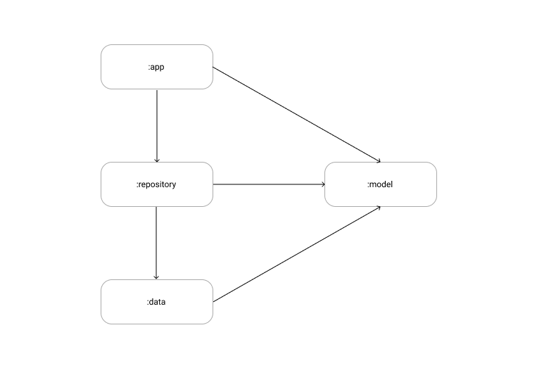

#  SojoDia

## About  
関西大学高槻キャンパス用のバス時刻表アプリ  

### Support  
API Level 23 ( Android 6.0 )

### Architecture  

#### :app  
View、Presenter など UI 関連  

#### :repository  
時刻表データ、設定の読み込み  

#### :data  
時刻データのアクセス、ローカルへの保存、メモリキャッシュ  

#### :model  
アプリ全般で使用するモデルクラス  
